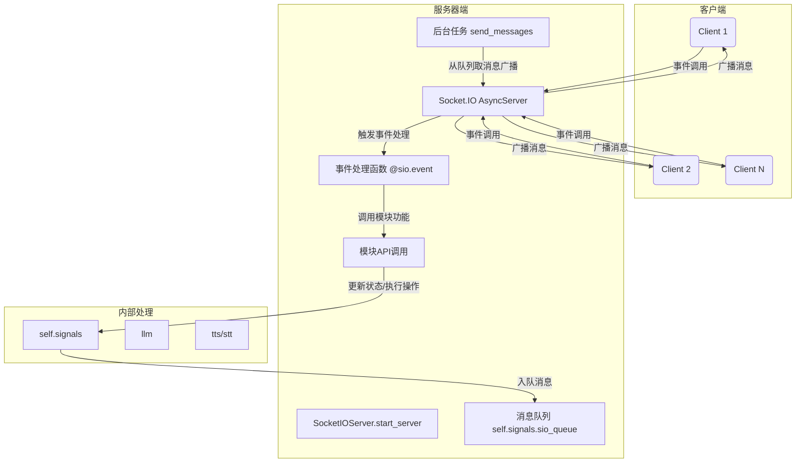

# 功能开发中...

```mermaid
flowchart TD
    subgraph 客户端
        Client1(Client 1)
        Client2(Client 2)
        ClientN(Client N)
    end

    subgraph 服务器端
        A[SocketIOServer.start_server]
        B[Socket.IO AsyncServer]
        C[事件处理函数 @sio.event]
        D[模块API调用 ]
        E[消息队列 self.signals.sio_queue]
        F[后台任务 send_messages]
    end

    subgraph 内部处理
        self.signals
        llm
        tts/stt
    end

    Client1 -- 事件调用 --> B
    Client2 -- 事件调用 --> B
    ClientN -- 事件调用 --> B
    B -- 触发事件处理 --> C
    C -- 调用模块功能 --> D
    D -- 更新状态/执行操作 --> self.signals
    self.signals -- 入队消息 --> E
    F -- 从队列取消息广播 --> B
    B -- 广播消息 --> Client1
    B -- 广播消息 --> Client2
    B -- 广播消息 --> ClientN
```
