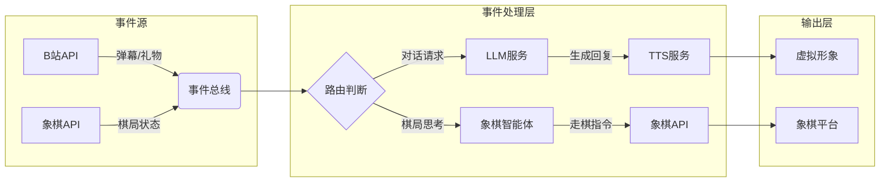

# 系统架构

| 版本号 | 日期       | 修改人 | 描述               |
| ------ | ---------- | ------ | ------------------ |
| 1.0    | 2025-04-27 | 利嘉烽 | 初版，确认基本需求 |
| 1.1    | 2025-06-15 | 王祎铭 | 完善架构内容       |

---

### 1. 引言

本报告旨在描述人工智能驱动的虚拟主播系统的整体架构设计决策、技术选型、质量属性以及设计原则。该架构的目标是实现一个可扩展、可维护、实时响应性良好的交互式系统。

---

### 2. 架构目标

* 支持多模态输入输出（语音、文字、图像）
* 解耦各功能组件，实现模块化、可替换、可测试
* 保证系统响应时延在可接受范围内（<500ms）
* 具备良好的可扩展性与可维护性
* 支持分布式部署与异步事件驱动通信

---

### 3. 架构模式选型

| 架构模式            | 原因说明                                           |
| ------------------- | -------------------------------------------------- |
| 事件驱动架构（EDA） | 模块解耦，适用于异步任务处理，如语音转写、生成应答 |
| 分层架构            | 清晰划分交互层、业务层、模型处理层，便于开发与测试 |
| 插件架构            | 支持 TTS/STT 等可插拔组件的灵活替换与扩展          |

---

### 4. 技术选型
 **1. 实时性约束**
| 场景                | 要求                          | 应对措施                          |
|---------------------|-------------------------------|-----------------------------------|
| 语音交互延迟        | 用户输入→AI响应 ≤1.5秒         | 优化STT/TTS云服务请求批处理        |
| 虚拟形象同步        | 表情变化延迟 ≤200ms            | 本地预加载动画资源                 |
| 象棋游戏指令响应    | 走棋指令处理 ≤500ms            | 本地轻量级象棋引擎                 |
---

**2. 第三方服务约束**
| 服务商      | 约束内容                      | 应对方案                          |
|-------------|-------------------------------|-----------------------------------|
| 科大讯飞TTS | QPS限制、音频长度≤5分钟        | 请求队列+本地音频拼接              |
| DeepSeek LLM| 输入Token上限（如4096）        | 自动截断历史对话（signals.py控制） |
| B站直播API  | WebSocket心跳间隔≤30秒         | 定时任务保活（room_manager.py）    |

**3. 开发与部署约束**
| 类别            | 约束内容                      | 解决方案                          |
|-----------------|-------------------------------|-----------------------------------|
| Python版本      | 仅支持3.10+（因match语法）     | 开发环境强制校验（pyproject.toml） |
| 操作系统        | 需兼容Windows（音频驱动差异）  | 抽象音频设备层（sounddevice封装）  |
| 网络环境        | 防火墙可能阻断WebSocket        | 提供HTTP轮询备选方案               |


**4. 安全与隐私约束**
| 风险点          | 约束要求                      | 实现方式                          |
|-----------------|-------------------------------|-----------------------------------|
| 用户语音数据    | 内存中驻留时间 ≤1分钟          | 定时清理音频缓冲区（stt.py）       |
| API密钥存储     | 禁止硬编码在代码中             | 环境变量+Vault服务动态获取         |
| 内容过滤        | 实时屏蔽违规词（如政治敏感）   | LLMState.py集成关键词黑名单        |

---

### 5. 模块划分与边界

* **STT/TTS 模块**：封装语音输入输出，标准接口`text2audio(text)`、`audio2text(audio)`
* **LLM Wrapper 模块**：接收文本输入，输出语言模型结果，支持事件触发调用与上下文管理
* **控制中心**：中介组件，负责调度、状态管理、日志记录等
* **事件总线（Signals）**：核心通信中枢，替代传统函数调用，发布-订阅模式驱动系统交互
* **前端通信 SocketIO 模块**：与用户界面同步语音、动作等信息
* **虚拟形象控制模块**：监听事件，控制虚拟形象动作与状态
* **小游戏 Game 模块**：独立业务模块，支持交互式对话与反馈
* **直播间管理模块**：解耦模块，负责对接直播平台，获取直播间消息
---

### 6. 模块交互机制（核心流程）
1. 事件驱动架构设计总览

2. 事件流详细设计
    事件流1：B站/象棋API → LLM对话
    ```mermaid
    sequenceDiagram
        participant B站API
        participant 象棋API
        participant 事件总线
        participant LLM服务
        participant TTS

        B站API->>事件总线: 弹幕消息(用户: "这步棋怎么走?")
        象棋API->>事件总线: 棋局FEN字符串
        事件总线->>LLM服务: 组装Prompt(弹幕+棋局)
        LLM服务->>TTS: 生成回复文本("建议走马二进三")
        TTS->>虚拟形象: 播放语音+表情
    ```
    事件流2：LLM回复 → TTS生成
    ```py
    # 在textLLMWrapper.py中的处理
    async def generate_reply():
        reply = await llm_api.call(prompt)
        if "[chess]" in reply:  # 检测象棋相关指令
            signals.chess_command_queue.put(reply)
        else:
            signals.tts_queue.put((reply, "neutral"))  # (文本, 默认表情)
    ```
    事件流3：象棋API → 智能体思考
    ```mermaid
    stateDiagram-v2
        [*] --> 等待棋局
        等待棋局 --> 解析棋局: 收到FEN
        解析棋局 --> 思考中: 调用智能体
        思考中 --> 生成走法: 返回SAN格式
        生成走法 --> 调用API: 提交走法
        调用API --> 等待棋局
    ```
---

### 7.数据流规范
| 数据流              | 协议                | 频率         |
|---------------------|---------------------|--------------|
| 用户语音→STT        | PCM音频流           | 50ms/包      |
| LLM回复→TTS         | JSON{text, emotion} | 异步触发     |
| 虚拟形象控制        | WebSocket二进制协议 | 100-300ms/次|
| B站直播间信息与心跳控制        | B站自带应用层协议 |心跳包20s/次 |
| 象棋接口控制        |象棋平台web接口协议   |100-300ms/次|
---

## 8. 部署视图

### 8.1 资源需求
| 组件         | CPU  | 内存  | 网络        |
|--------------|------|-------|-------------|
| 主进程       | 4核  | 1GB   | 10Mbps↑     |
| STT服务      | 2核  | 1GB   | 5Mbps↑      |
| 象棋引擎     | 1核  | 1GB   | 低延迟内网  |

### 9. 架构质量属性支持策略

| 属性     | 策略                                               |
| -------- | -------------------------------------------------- |
| 可扩展性 | 使用事件驱动 + 插件化模块，便于替换 TTS/LLM 等组件 |
| 可维护性 | 各模块职责单一，依赖通过事件注入减少耦合           |
| 可测试性 | 事件总线可 mock，模块可独立测试                    |
| 响应性   | 异步驱动、轻量事件传输，避免阻塞                   |

---

### 10. 潜在风险与后续优化

| 风险                         | 优化建议                                       |
| ---------------------------- | ---------------------------------------------- |
| 信号系统无队列缓冲，易丢事件 | 使用 asyncio.Queue 替代事件回调机制            |
| 模型模块阻塞主线程           | 使用独立子进程或异步封装提升响应能力           |
| 模块之间消息格式不统一       | 使用数据协议（如 Pydantic schema）统一事件结构 |

---

### 10. 总结

本架构设计为原型系统提供了基础的可扩展性与良好的开发支持，后续在系统稳定与性能要求提高后，可进一步引入微服务、任务队列等更完整的分布式机制以提升可靠性与容错能力。
