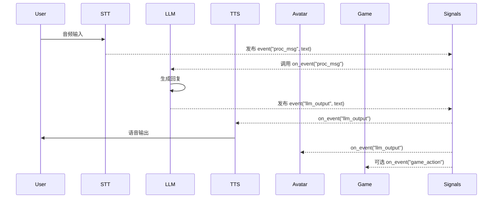

# 系统架构

| 版本号 | 日期       | 修改人 | 描述               |
| ------ | ---------- | ------ | ------------------ |
| 1.0    | 2025-04-27 | 利嘉烽 | 初版，确认基本需求 |

---

### 1. 引言

本报告旨在描述人工智能驱动的虚拟主播系统的整体架构设计决策、技术选型、质量属性以及设计原则。该架构的目标是实现一个可扩展、可维护、实时响应性良好的交互式系统。

---

### 2. 架构目标

* 支持多模态输入输出（语音、文字、图像）
* 解耦各功能组件，实现模块化、可替换、可测试
* 保证系统响应时延在可接受范围内（<500ms）
* 具备良好的可扩展性与可维护性
* 支持分布式部署与异步事件驱动通信

---

### 3. 架构模式选型

| 架构模式            | 原因说明                                           |
| ------------------- | -------------------------------------------------- |
| 事件驱动架构（EDA） | 模块解耦，适用于异步任务处理，如语音转写、生成应答 |
| 分层架构            | 清晰划分交互层、业务层、模型处理层，便于开发与测试 |
| 插件架构            | 支持 TTS/STT 等可插拔组件的灵活替换与扩展          |

---

### 4. 技术选型

| 层级/功能 | 技术方案                            | 理由                               |
| --------- | ----------------------------------- | ---------------------------------- |
| 服务通信  | Socket.IO                           | 实时双向通信，兼容性好             |
| 消息调度  | 自定义 Signals（轻量事件总线）      | 低延迟，易于控制，满足单机原型需求 |
| 模型封装  | Python 模块封装 + 统一 Wrapper 接口 | 隐藏复杂性，统一调用               |
| 虚拟形象  | VTube Studio + 控制层 API 封装      | 易集成，功能丰富                   |
| 开发语言  | Python 3.10                         | 便于快速开发                       |
| 部署方式  | 单机 Docker / 多进程部署            | 原型开发阶段使用轻量部署           |

---

### 5. 模块划分与边界

* **STT/TTS 模块**：封装语音输入输出，标准接口`text2audio(text)`、`audio2text(audio)`
* **LLM Wrapper 模块**：接收文本输入，输出语言模型结果，支持事件触发调用与上下文管理
* **控制中心**：中介组件，负责调度、状态管理、日志记录等
* **事件总线（Signals）**：核心通信中枢，替代传统函数调用，发布-订阅模式驱动系统交互
* **前端通信 SocketIO 模块**：与用户界面同步语音、动作等信息
* **虚拟形象控制模块**：监听事件，控制虚拟形象动作与状态
* **小游戏 Game 模块**：独立业务模块，支持交互式对话与反馈

---

### 6. 模块交互机制（核心流程）

---

### 7. 架构质量属性支持策略

| 属性     | 策略                                               |
| -------- | -------------------------------------------------- |
| 可扩展性 | 使用事件驱动 + 插件化模块，便于替换 TTS/LLM 等组件 |
| 可维护性 | 各模块职责单一，依赖通过事件注入减少耦合           |
| 可测试性 | 事件总线可 mock，模块可独立测试                    |
| 响应性   | 异步驱动、轻量事件传输，避免阻塞                   |

---

### 8. 潜在风险与后续优化

| 风险                         | 优化建议                                       |
| ---------------------------- | ---------------------------------------------- |
| 信号系统无队列缓冲，易丢事件 | 使用 asyncio.Queue 替代事件回调机制            |
| 模型模块阻塞主线程           | 使用独立子进程或异步封装提升响应能力           |
| 模块之间消息格式不统一       | 使用数据协议（如 Pydantic schema）统一事件结构 |

---

### 9. 总结

本架构设计为原型系统提供了基础的可扩展性与良好的开发支持，后续在系统稳定与性能要求提高后，可进一步引入微服务、任务队列等更完整的分布式机制以提升可靠性与容错能力。
