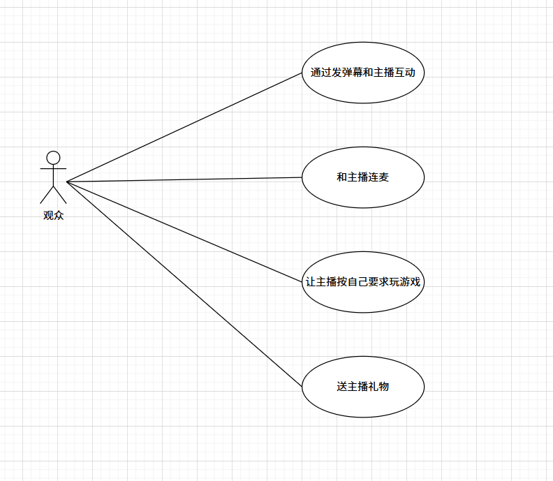
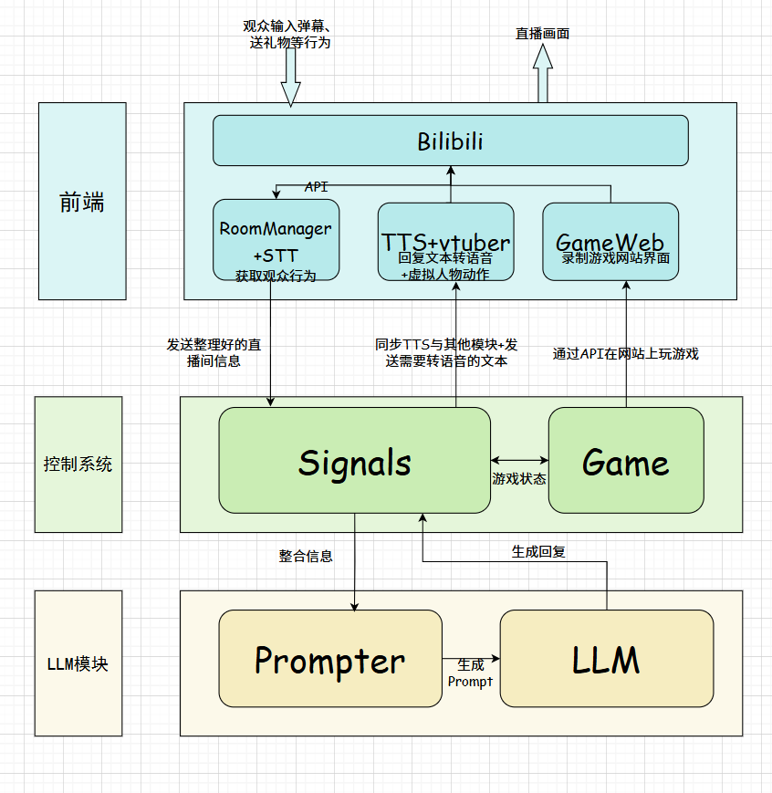
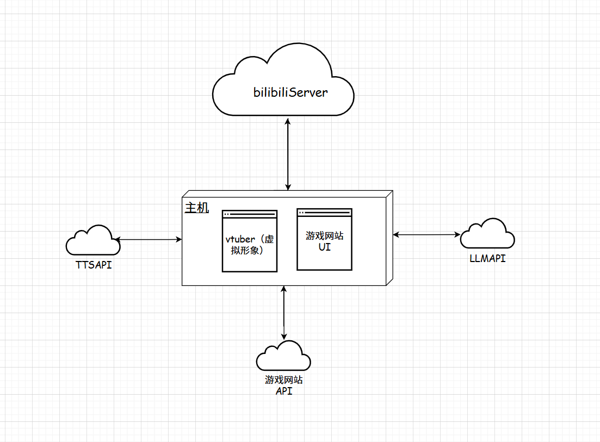
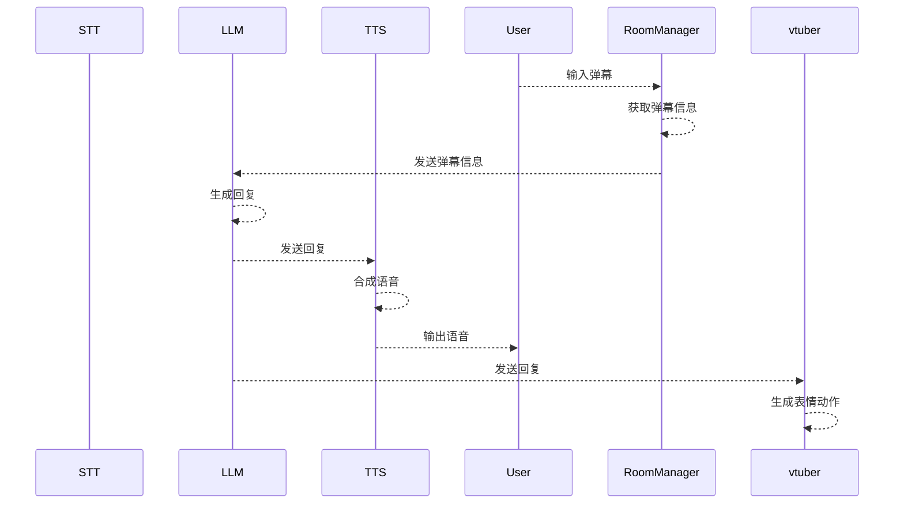
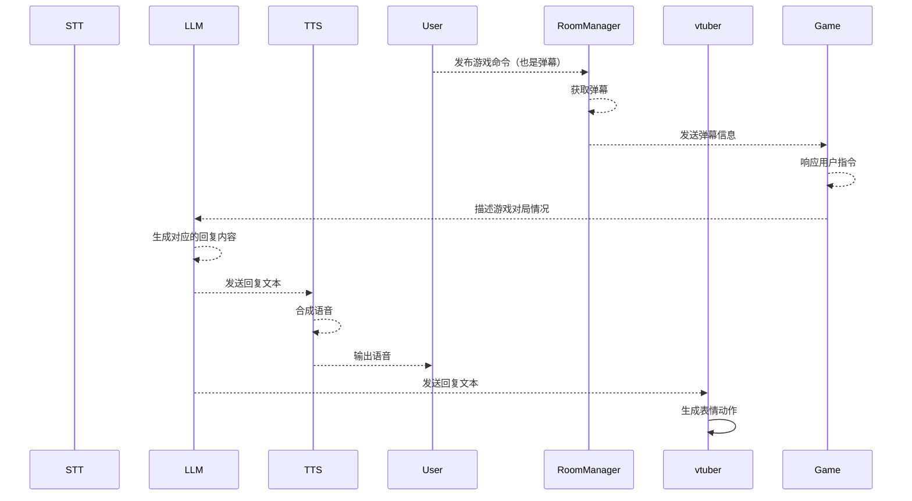
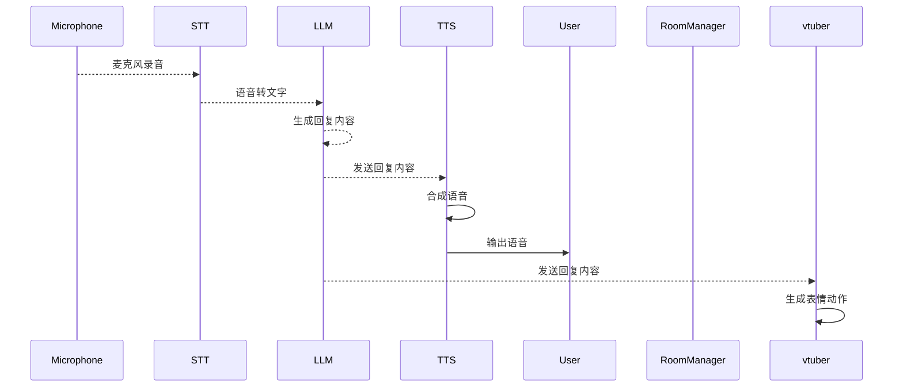
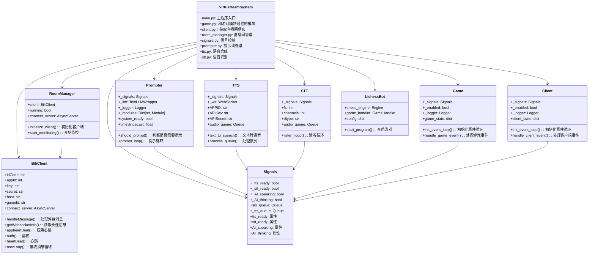

# 系统建模报告

| 版本号 | 日期       | 修改人 | 描述               |
| ------ | ---------- | ------ | ------------------ |
| 1.0    | 2025-04-27 | 利嘉烽 | 初版，确认基本需求 |
| 2.0    | 2025-5-10  | 李源卿 | 终版，确认系统建模 |
---

## 1. 引言

### 1.1 项目背景

本项目旨在建立一个轻量级的人工智能主导向的主播系统编写框架。
系统会涉及语音识别、语音合成、虚拟形象渲染等等功能。
我们希望通过一个基本的框架来将现有成熟的技术进行整合，以此提供一种新型的网络直播交互方式。

### 1.2 读者范围

本篇报告适合的读者：
- 组件开发人员
- 系统建模人员

### 1.3 报告范围

报告会从场景视图开始介绍，
之后深入到逻辑视图、物理视图、过程视图。
通过不同的视图让读者快速了解项目的架构。
最后提供开发视图指导目前项目的开发。

---

## 2. 场景视图

### 场景视图概述
- **参与者**：观众
- **场景目的**：呈现观众与AI主播之间的互动方式

### 互动场景描述
1. **通过发弹幕和AI主播互动**：观众借助发送弹幕这一方式，在直播过程中实时表达想法、提问、发表评论等，实现与AI主播及其他观众间的信息交流。
2. **和AI主播连麦**：观众有机会与AI主播建立语音或视频连接，直接进行对话交流，或参与AI主播组织的互动活动。 
3. **让AI主播按自己要求玩游戏**：观众依据自身喜好，向AI主播提出游戏操作方面的要求，影响AI主播的游戏直播内容。 
4. **送AI主播礼物**：观众以赠送虚拟礼物的形式，向AI主播表达支持、喜爱与赞赏。

## 3. 逻辑视图

### 整体架构
该逻辑视图展示了AI主播系统的工作流程，主要分为前端、Bilibili平台相关模块、控制系统和LLM模块，各部分协同实现AI主播与观众的互动。

### 前端
负责呈现直播画面给观众，同时接收观众输入的弹幕、送礼物等行为，并将这些信息传递给后续模块处理。

### Bilibili平台相关模块
- **Bilibili**：作为直播平台核心，接收前端传来的观众行为信息。通过API与下方三个子模块交互：
  - **RoomManager + STT**：RoomManager负责管理直播间相关事务，STT（Speech - to - Text，语音转文字）将观众语音弹幕等转化为文字信息，实现获取观众行为的功能。
  - **TTS + vtuber**：TTS（Text - to - Speech，文本转语音）把回复文本转换为语音，同时驱动vtuber（虚拟主播）做出相应动作，使虚拟主播能以语音和动作形式回应观众。
  - **GameWeb**：用于录制游戏网站界面，支持通过API实现在网站上玩游戏的功能，满足观众让主播按要求玩游戏的需求。

### 控制系统
- **Signals**：接收来自Bilibili模块整理好的直播间信息，进行整合。一方面同步TTS与其他模块，发送需要转语音的文本；另一方面与Game模块交互，获取游戏状态信息，并将整合后的信息传递给LLM模块。
- **Game**：与Signals模块交互，提供游戏状态信息，同时接收Signals模块指令，实现按观众要求玩游戏的功能，并将游戏相关回复信息反馈给Signals模块。

### LLM模块
- **Prompter**：接收Signals模块整合后的信息，生成Prompt（提示词），为LLM提供输入内容。
- **LLM（Large Language Model，大语言模型）**：根据接收到的Prompt生成回复内容，反馈给Signals模块，推动整个直播互动流程。  
---

## 4. 物理视图

### 整体架构
该物理视图展示了AI主播系统的物理部署结构，主要由主机以及与主机相连的多个外部服务组成，体现了系统各组件间的物理连接关系。

### 主要组件
- **主机**：作为核心物理设备，承载了两个关键部分。
  - **vtuber（虚拟形象）**：在主机上运行，通过与其他组件协同，实现虚拟主播的展示和动作呈现等功能。
  - **游戏网站UI**：负责展示游戏网站的用户界面，为观众呈现游戏相关画面。
- **bilibiliServer**：以云端服务形式存在，与主机进行数据交互。主要用于处理直播相关业务，如接收和分发观众的弹幕、礼物等信息，是AI主播与观众互动的重要平台支撑。
- **TTSAPI**：作为文本转语音服务的接口，以云端形式部署。主机通过与该接口交互，实现将文本内容转换为语音输出，驱动虚拟主播发声。
- **LLMAPI**：代表大语言模型接口，同样以云端形式存在。主机借助此接口，利用大语言模型的能力生成回复内容，用于虚拟主播与观众的对话互动。
- **游戏网站API**：以云端服务呈现，与主机上的游戏网站UI进行通信。通过该API，主机能够实现对游戏网站的操作控制，满足观众让主播按要求玩游戏等需求。

## 5. 过程视图
此处省略了中间控制系统`Signals`，因为所有的信息都会经过这里，然后到达指定模块。
### 5.1 弹幕聊天场景

#### 描述
这张时序图展示了AI主播与用户通过弹幕进行互动的流程，涉及多个模块，各模块按顺序协同工作，具体如下：
- **用户输入弹幕**：用户（User）在直播平台上输入弹幕，这是整个互动流程的起点。
- **RoomManager获取弹幕信息**：RoomManager接收到用户输入的弹幕，对弹幕信息进行获取和整理，准备后续处理。
- **RoomManager发送弹幕信息给LLM**：RoomManager将整理好的弹幕信息发送给大语言模型（LLM），让LLM基于这些信息生成回复。
- **LLM生成回复**：LLM接收到弹幕信息后，进行分析处理，生成相应的回复内容。
- **LLM发送回复给TTS**：LLM将生成的回复内容发送给文本转语音模块（TTS），以便将文字回复转换为语音。
- **TTS合成语音**：TTS接收到回复文本后，进行语音合成操作，将文字转换为语音形式。
- **TTS输出语音给用户**：合成好的语音通过TTS输出给用户，让用户能够听到AI主播的回复。
- **LLM发送回复给vtuber**：在向TTS发送回复的同时，LLM也将回复内容发送给虚拟形象（vtuber），驱动虚拟形象做出反应。
- **vtuber生成表情动作**：vtuber接收到回复内容后，根据回复生成相应的表情和动作，在直播画面中展示给用户，完成整个互动流程。
### 5.2 游戏场景

### 5.2 游戏场景时序图描述

该时序图展示了用户通过弹幕指令参与游戏时的完整交互流程：

1. **用户指令输入**  
   - 用户通过弹幕形式向RoomManager发布游戏命令。

2. **弹幕处理阶段**  
   - RoomManager获取用户弹幕内容后，将指令转发给游戏系统(Game)。

3. **游戏响应**  
   - 游戏系统接收指令后处理逻辑，更新对局状态，并向LLM发送当前游戏场景描述。

4. **AI生成回复**  
   - LLM根据游戏状态生成两种输出：  
     a) 语音回复文本 → 发送至TTS系统合成语音 → 最终播报给用户  
     b) 动作指令文本 → 发送至VTuber系统驱动虚拟形象的表情和动作

5. **多模态反馈**  
   - 用户同时接收到语音播报（通过TTS）和虚拟形象的实时动作反馈（通过VTuber系统），形成沉浸式交互体验。
### 5.3 语音场景

### 5.3 语音场景时序图描述

该时序图展示了用户通过语音与系统交互的全流程：

1. **语音输入阶段**  
   - 用户通过麦克风进行语音输入，原始音频数据被发送至STT（语音转文本）模块。

2. **语音转文本**  
   - STT模块将语音转换为文字后，通过RoomManager将文本内容传递给LLM（大语言模型）。

3. **智能回复生成**  
   - LLM分析文本语义后生成两种输出：  
     a) 回复文本 → 发送至TTS系统进行语音合成  
     b) 行为指令 → 发送至VTuber系统驱动虚拟形象  

4. **多模态输出**  
   - TTS系统将文本合成为语音后播放给用户  
   - VTuber系统同步生成对应的表情和动作反馈  

5. **闭环交互**  
   - 整个过程形成"语音输入→文本理解→语音/动作输出"的实时交互闭环  
   - 所有模块通过RoomManager进行协调，确保语音、文本、虚拟形象的同步输出

---

## 6. 开发视图

### 核心系统架构

Virtustream系统是一个B站虚拟主播直播管理平台，主要包含以下核心组件：

1. **主控制系统(VirtustreamSystem)**
   - 作为系统入口，协调各模块运行
   - 包含main.py主程序

2. **直播间管理模块**
   - `BiliClient`: 处理B站直播API通信
     - 维护长连接状态(gameId, host等)
     - 处理各类直播消息(弹幕、礼物、上舰等)
     - 实现心跳机制保持连接
   - `RoomManager`: 直播间状态管理
     - 初始化B站客户端
     - 监控直播间状态

3. **信号控制系统(Signals)**
   - 作为中央事件总线
   - 管理TTS/STT就绪状态
   - 管理AI状态，如：是否在思考
   - 提供消息队列(sio_queue, tts_queue)

4. **交互处理模块**
   - `Prompter`: 生成主播回应
     - 根据消息队列决定何时触发回应
     - 控制回应频率(WAIT_TIME)
   - `TTS`: 文本转语音
     - 集成讯飞语音合成API
     - 管理WebSocket连接和音频队列
   - `STT`: 语音识别(当前版本未完全实现)

5. **游戏和客户端模块**
   - `Game`: 处理游戏相关事件
     - 维护游戏状态
     - 与直播互动功能集成
   - `Client`: 外部客户端接口
     - 处理用户输入事件
     - 提供扩展功能接口

6. **LichessBot模块**
   - 国际象棋引擎集成
   - 作为独立子系统运行
   - 通过配置与主系统交互

### 关键数据流

1. **直播消息处理流程**:
   BiliClient → RoomManager → Signals → Prompter → TTS → 语音输出

2. **用户交互流程**:
   Client/Game → Signals → Prompter → TTS → 语音反馈

3. **系统控制流**:
   主程序通过Signals协调各模块状态，确保:
   - TTS/STT就绪后才处理语音
   - AI不重复响应(thinking/speaking状态互斥)

### 设计特点

1. **模块化设计**:
   - 各功能模块通过Signals松耦合
   - 便于单独测试和扩展

2. **多线程架构**:
   - 关键组件(Prompter, TTS等)运行在独立线程
   - 通过队列机制实现线程安全

3. **状态集中管理**:
   - Signals作为唯一状态源
   - 避免分布式状态不一致

4. **扩展性**:
   - 通过Client/Game模块支持功能扩展
   - LichessBot展示外部系统集成方式
