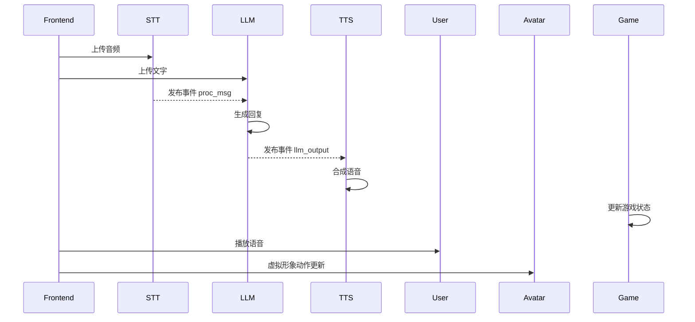
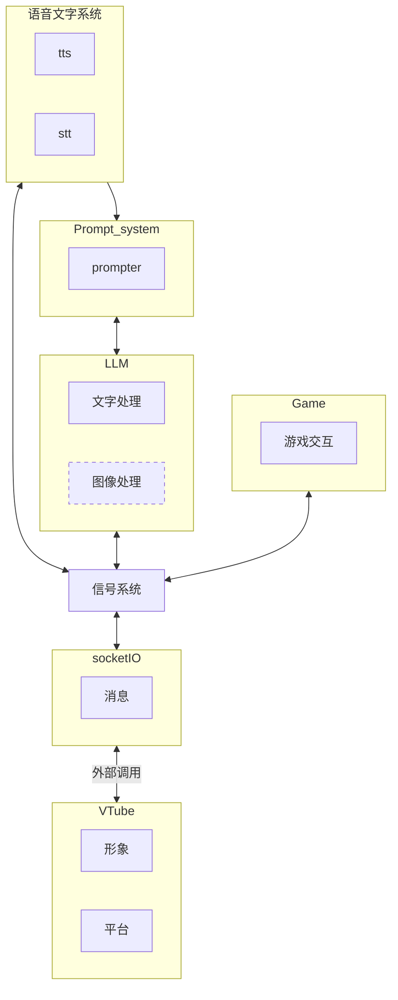
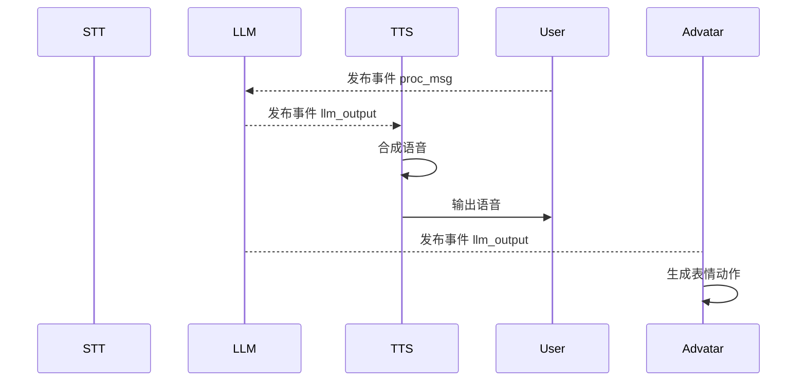
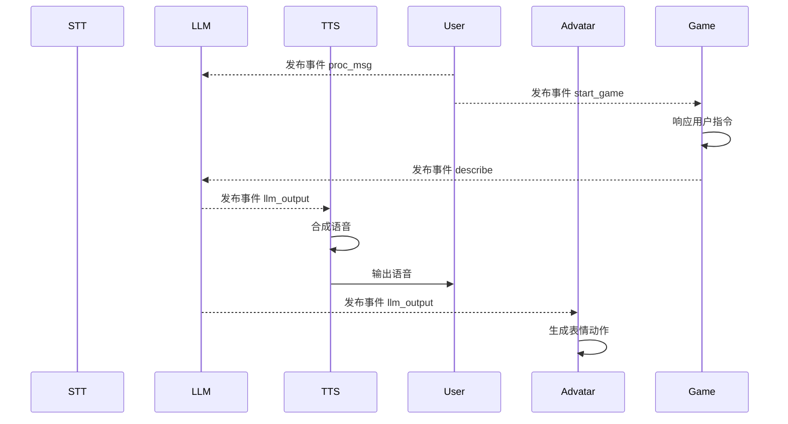
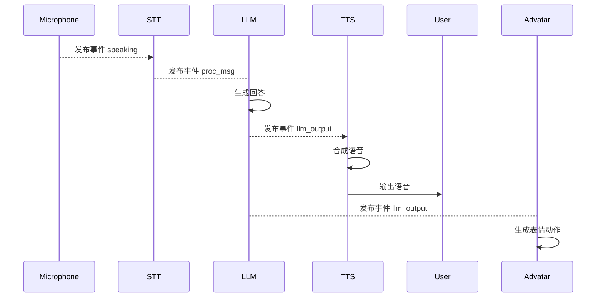

# 系统建模报告

| 版本号 | 日期       | 修改人 | 描述               |
| ------ | ---------- | ------ | ------------------ |
| 1.0    | 2025-04-27 | 利嘉烽 | 初版，确认基本需求 |

---

## 1. 引言

### 1.1 项目背景

本项目旨在建立一个轻量级的人工智能主导向的主播系统编写框架。
系统会涉及语音识别、语音合成、虚拟形象渲染等等功能。
希望通过一个基本的框架来将现有成熟的技术进行整合，
并且提供一种新型的网络直播交互方式。

### 1.2 读者范围

本篇报告适合的读者：
- 组件开发人员
- 系统建模人员

### 1.3 报告范围

报告会从总体架构开始介绍，
之后深入到逻辑视图、物理视图、开发视图、过程视图。
通过不同的视图让读者快速了解项目的架构。
最后提供数据建模指导目前项目的开发。

---

## 2. 总体架构

本项目采用事件驱动的方式来对组件进行交互。
项目的主要模块包括：

| 模块名称      | 职责说明               |
| ------------- | ---------------------- |
| STT 服务      | 将用户语音转为文本     |
| LLM Wrapper   | 调用大语言模型生成回复 |
| TTS 服务      | 文本转语音生成音频     |
| 控制中心      | 任务调度、状态管理     |
| SocketIO 服务 | 负责前后端双向通信     |
| 游戏 服务     | 提供用户游戏交互功能   |

模块之间通过事件流的交互如下：

## 3. 逻辑视图

整个项目的模块划分如下：

| 模块     | 说明           | 子模块 |
| -------- | -------------- | ------ |
| LLM      | 调用大语言模型 | ...    |
| TTS/STT  | 语音转换       | ...    |
| Signals  | 事件总线       | ...    |
| Advatar  | 虚拟形象       | ...    |
| Game     | 小游戏交互     | ...    |
| SocketIO | 外部信息交互   | ...    |

### 3.1 LLM

- 模块职责：协调tts和stt的结果，还要对game的状态进行描述。
- 接口设计：
  - process_message(text: str) -> text
    - 处理文本输入
  - on_event("proc_msg")
    - 处理出现用户输入的事件，并且生成一个llm_output事件
  - on_event("describe")
    - 处理游戏的描述事件，并且还要生成一个llm_output事件
  
### 3.2 TTS/STT

- 模块职责：负责将文本和语音进行相互转换
- 接口设计
  - text2autio(text: str) -> bytes
    - 文字转语音信号
  - autio2text(b: bytes) -> str
    - 语音转文字信号
  - on_event("llm_output")
    - 当llm产生输出事件，需要处理llm的输出，转换为语音信号
    - 产生语音生成事件，以供后续语音设备监控
  - on_event("user_input")
    - 当产生用户输入事件，用户输入分为语音和文字
    - 需要将内容统一为文字，然后生成一个信息处理事件。

### 3.3 Signals

- 模块职责：负责传播各个组件的事件
- 接口设计：
  - add_event(event: dict)
    - 接收一个字典，包装成一个事件，通知到其他组件
  - register(event_name: str, call_func: function)
    - 注册一个回调函数，处理对应的事件

### 3.4 Advatos

- 模块职责：负责脸部表情的组织
- 接口设计：
  - render(text: str)
    - 将提供的文本内容与对应的脸部表情进行组织

### 3.5 Game

- 模块职责：负责游戏交互
- 接口设计：
  - actions() -> list
    - 提供可以执行的操作
  - take_action(act)
    - 执行某个操作
    - 触发一个让llm进行描述的事件(describe)
  - render()
    - 对游戏界面进行渲染

---

## 4. 物理视图

具体的部署后的关联视图如下：

## 5. 过程视图

### 5.1 弹幕聊天场景

### 5.2 游戏场景

### 5.3 语音场景

---

### 6. 数据建模

这个部分需要每个部分的UML图。
负责自己部分的自己绘制吧，毕竟会有修改。
